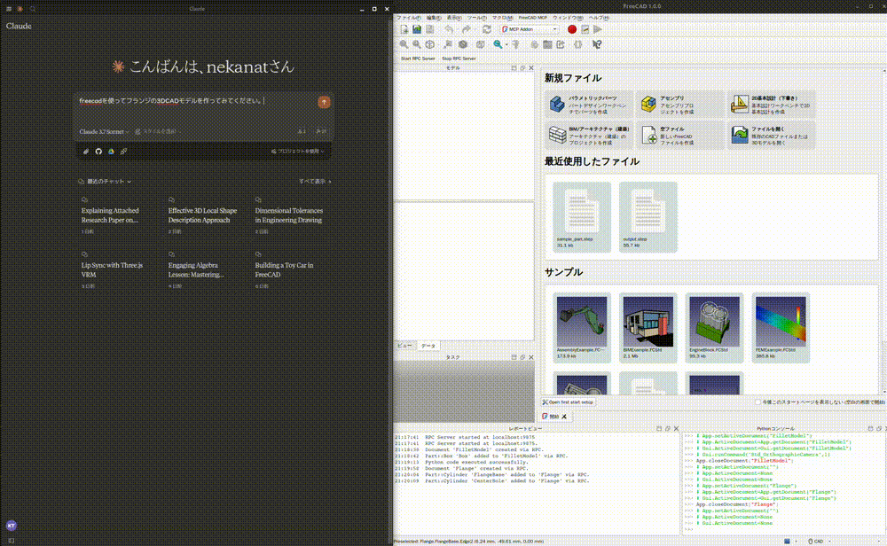
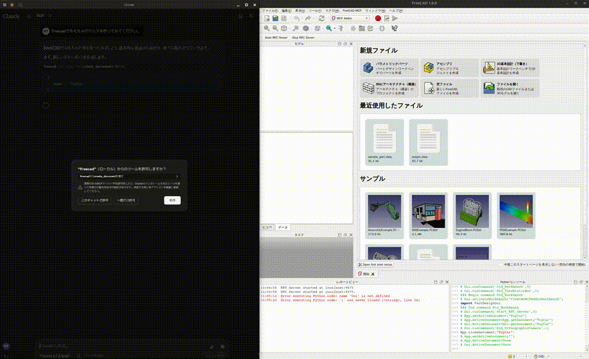
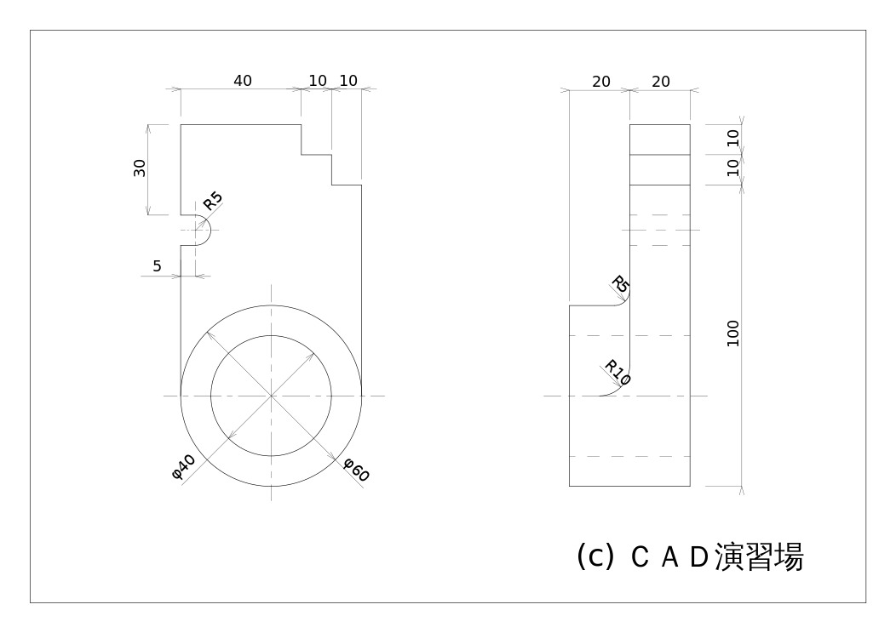

# Demos and examples

[English](examples.md) · [中文](examples.zh.md) · [Back to README](../README.md) · [Installation](installation.md) · [Tools](tools.md)

## Design demos

### Design a flange

### Design a toy car

### Design a part from a 2D drawing

Input drawing:

Demo:

[Conversation history](https://claude.ai/share/7b48fd60-68ba-46fb-bb21-2fbb17399b48)

## Example scripts

These scripts live in the upstream repository and run against the FreeCAD addon;
they are independent of the language the MCP server is written in.

| Example | Description |
| --- | --- |
| [Cantilever FEM analysis](https://github.com/neka-nat/freecad-mcp/blob/main/examples/cantilever_fem.py) | Build a cantilever, run CalculiX, and compare the results with an analytical solution. |
| [Google ADK agent](https://github.com/neka-nat/freecad-mcp/blob/main/examples/adk/agent.py) | Connect an ADK agent to the MCP server using a local checkout. |
| [LangChain / LangGraph agent](https://github.com/neka-nat/freecad-mcp/blob/main/examples/langchain/react.py) | Run an interactive CAD agent using MCP tools and a Groq model. |

The agent examples use optional third-party dependencies and provider
configuration. Adjust the repository path and model settings in each example
before running it; the LangChain example also expects `GROQ_API_KEY` in the
environment. Both agent examples launch an MCP server process themselves, so
point them at the Go binary built from this repository
(see [installation](installation.md)) instead of the Python entry point.
