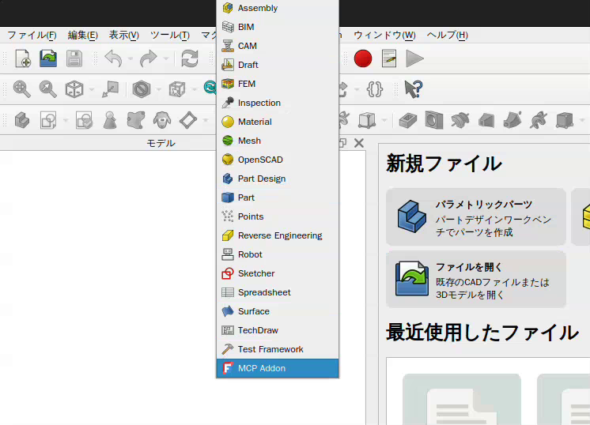

# 安装

[English](installation.md) · [中文](installation.zh.md) · [返回 README](../README.zh.md) · [配置](configuration.zh.md)

在配置插件（addon）和 MCP 客户端之前，请先安装 FreeCAD 和 Go 工具链。
`go.mod` 中声明了 `go 1.26.2`；Go 1.21 及更高版本会在需要时自动下载该工具链。

FreeCAD MCP 包含两个组件，本仓库同时提供这两者：

| 组件 | 位置 | 语言 |
| --- | --- | --- |
| FreeCAD 插件（addon），即 FreeCAD 内部的 RPC 服务 | `addon/FreeCADMCP` | Python，在 FreeCAD 内运行 |
| MCP server（由你的 MCP 客户端启动） | 仓库根目录 | Go |

本仓库只构建 MCP server；插件（addon）是
[上游插件](https://github.com/neka-nat/freecad-mcp)的副本，无需构建步骤。

## 克隆并构建 MCP server

```bash
git clone https://github.com/cnPauLi/freecad-go-mcp.git
cd freecad-go-mcp
go build -o freecad-go-mcp .
```

唯一的依赖是 [`mark3labs/mcp-go`](https://github.com/mark3labs/mcp-go)，
`go build` 会自动获取它。如果网络较慢，请先使用镜像：

```bash
export GOPROXY=https://mirrors.aliyun.com/goproxy/,direct
```

> `go env -w GOPROXY=...` 不会覆盖环境中已存在的 `GOPROXY`；
> 请像上面那样在命令行中 export 它。

你也可以将二进制文件安装到 `GOBIN` 而不是当前工作目录：

```bash
go install github.com/cnPauLi/freecad-go-mcp@latest
```

## 安装插件

将本仓库中的 `addon/FreeCADMCP` 目录复制到你的 FreeCAD 安装对应的插件（addon）
目录中。最终目录应为 `Mod/FreeCADMCP`。

### 插件目录

| 平台 / 安装方式 | 目录 |
| --- | --- |
| Windows | `%APPDATA%\FreeCAD\Mod\` |
| macOS，FreeCAD 1.1 | `~/Library/Application Support/FreeCAD/v1-1/Mod/` |
| macOS，FreeCAD 1.0 | `~/Library/Application Support/FreeCAD/v1-0/Mod/` |
| Linux，Ubuntu | `~/.FreeCAD/Mod/` |
| Linux，Snap | `~/snap/freecad/common/Mod/` |
| Linux，Debian | `~/.local/share/FreeCAD/Mod/` |
| Linux，Arch / CachyOS（来自 `extra/freecad` 的 FreeCAD 1.1） | `~/.local/share/FreeCAD/v1-1/Mod/` |
| Linux，Flatpak | `~/.var/app/org.freecad.FreeCAD/data/FreeCAD/v1-1/Mod/` |

### 复制命令

在克隆的仓库中运行适用于你的安装方式的命令。

Ubuntu：

```bash
mkdir -p ~/.FreeCAD/Mod/
cp -r addon/FreeCADMCP ~/.FreeCAD/Mod/
```

Debian：

```bash
mkdir -p ~/.local/share/FreeCAD/Mod/
cp -r addon/FreeCADMCP ~/.local/share/FreeCAD/Mod/
```

Arch / CachyOS，来自 `extra/freecad` 的 FreeCAD 1.1：

```bash
mkdir -p ~/.local/share/FreeCAD/v1-1/Mod/
cp -r addon/FreeCADMCP ~/.local/share/FreeCAD/v1-1/Mod/
```

Flatpak：

```bash
mkdir -p ~/.var/app/org.freecad.FreeCAD/data/FreeCAD/v1-1/Mod/
cp -r addon/FreeCADMCP ~/.var/app/org.freecad.FreeCAD/data/FreeCAD/v1-1/Mod/
```

macOS，FreeCAD 1.1：

```bash
mkdir -p ~/Library/Application\ Support/FreeCAD/v1-1/Mod/
cp -r addon/FreeCADMCP ~/Library/Application\ Support/FreeCAD/v1-1/Mod/
```

## 启动 RPC 服务

安装插件（addon）后重启 FreeCAD，然后从工作台列表中选择 **MCP Addon**。



在 **FreeCAD MCP** 工具栏中点击 **Start RPC Server**。


该服务监听 `localhost:9875`，并在 `/RPC2` 上响应 XML-RPC 请求。
默认需要手动启动。参见
[自动启动配置](configuration.zh.md#自动启动-rpc-服务)，以便在后续启动时启用它。

## 连接 MCP 客户端

将你的客户端指向构建好的二进制文件。请把 `/path/to/freecad-go-mcp` 替换为它的
绝对路径：

```json
{
  "mcpServers": {
    "freecad": {
      "command": "/path/to/freecad-go-mcp",
      "args": []
    }
  }
}
```

修改客户端配置后请重启客户端。请保持 FreeCAD 打开并让 RPC 服务处于运行状态。
对于远程 FreeCAD 安装，参见
[远程连接](configuration.zh.md#远程连接)。

### 从源码运行

开发时可以直接从检出的源码运行该服务：

```bash
go run . --help
go test ./...
```

MCP server 将日志写入 stderr，并把 stdout 留给 MCP 协议，因此
`go run` 进程也可以作为客户端的 `command` 使用：

```json
{
  "mcpServers": {
    "freecad": {
      "command": "go",
      "args": ["run", "/path/to/freecad-go-mcp"]
    }
  }
}
```

修改插件（addon）代码后，请将更新后的 `addon/FreeCADMCP` 目录复制到
FreeCAD 的插件目录中，并同样重启 FreeCAD。